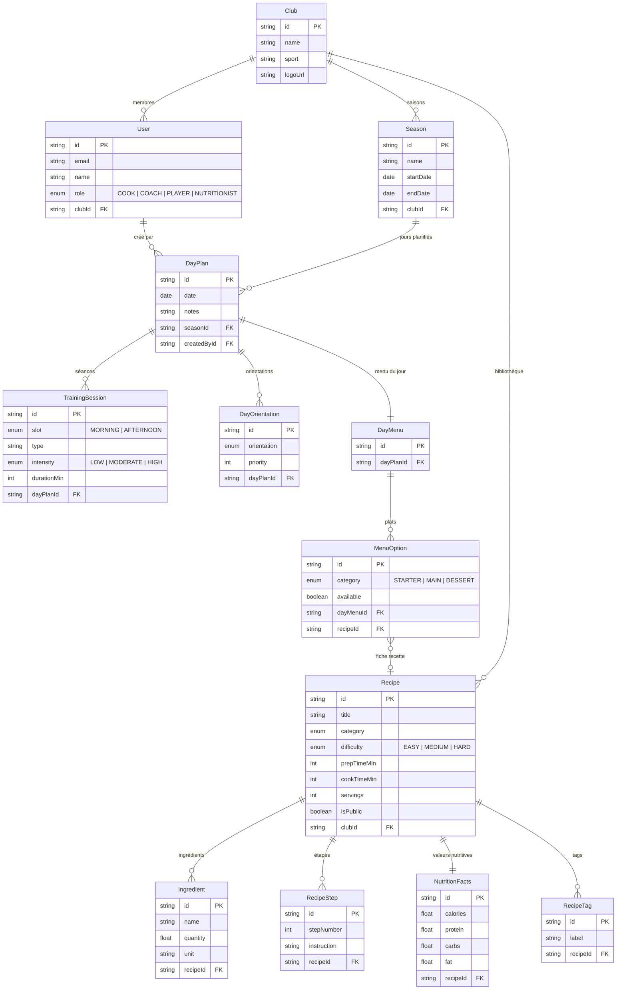

# NutriSport — Schéma de données

```mermaid
erDiagram

  Club {
    string id PK
    string name
    string sport
    string logoUrl
  }

  User {
    string id PK
    string email
    string name
    enum role "COOK | COACH | PLAYER | NUTRITIONIST"
    string clubId FK
  }

  Season {
    string id PK
    string name
    date startDate
    date endDate
    string clubId FK
  }

  DayPlan {
    string id PK
    date date
    string notes
    string seasonId FK
    string createdById FK
  }

  TrainingSession {
    string id PK
    enum slot "MORNING | AFTERNOON"
    string type
    enum intensity "LOW | MODERATE | HIGH"
    int durationMin
    string dayPlanId FK
  }

  DayOrientation {
    string id PK
    enum orientation
    int priority
    string dayPlanId FK
  }

  DayMenu {
    string id PK
    string dayPlanId FK
  }

  MenuOption {
    string id PK
    enum category "STARTER | MAIN | DESSERT"
    boolean available
    string dayMenuId FK
    string recipeId FK
  }

  Recipe {
    string id PK
    string title
    enum category
    enum difficulty "EASY | MEDIUM | HARD"
    int prepTimeMin
    int cookTimeMin
    int servings
    boolean isPublic
    string clubId FK
  }

  Ingredient {
    string id PK
    string name
    float quantity
    string unit
    string recipeId FK
  }

  RecipeStep {
    string id PK
    int stepNumber
    string instruction
    string recipeId FK
  }

  NutritionFacts {
    string id PK
    float calories
    float protein
    float carbs
    float fat
    string recipeId FK
  }

  RecipeTag {
    string id PK
    string label
    string recipeId FK
  }

  Club ||--o{ User        : "membres"
  Club ||--o{ Season      : "saisons"
  Club ||--o{ Recipe      : "bibliothèque"

  Season ||--o{ DayPlan   : "jours planifiés"

  User   ||--o{ DayPlan   : "créé par"

  DayPlan ||--o{ TrainingSession  : "séances"
  DayPlan ||--o{ DayOrientation   : "orientations"
  DayPlan ||--|| DayMenu          : "menu du jour"

  DayMenu ||--o{ MenuOption       : "plats"

  MenuOption }o--o| Recipe        : "fiche recette"

  Recipe ||--o{ Ingredient        : "ingrédients"
  Recipe ||--o{ RecipeStep        : "étapes"
  Recipe ||--|| NutritionFacts    : "valeurs nutritives"
  Recipe ||--o{ RecipeTag         : "tags"
```
